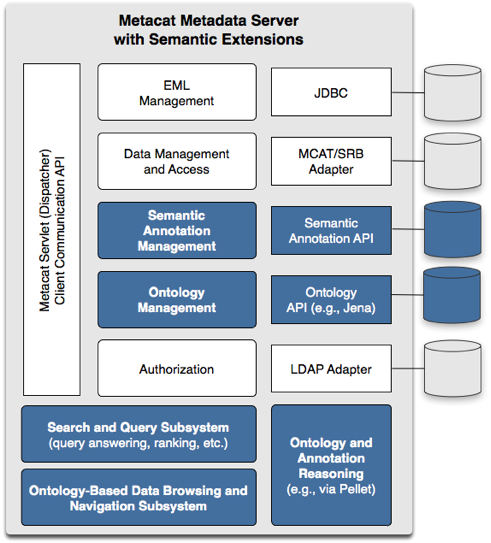

# Supplementary Figures

## Figure 1: Semantic extenstions to Metacat.

Semantic extensions (highlighted in blue) to the Metacat data and metadata repository support improved precision and recall in searches for scientific data sets.

 
## Figure 2. Semantic search components.

The components of our semantic-search framework including relational data, EML-based metadata, semantic annotations based on OBOE, and OBOE domain-ontology extensions.

 
## Figure 3. Conceptual annotations.

Example annotations demonstrating more precise search results for observation-based structured query.

 
## Figure 4.  OBOE Annotation.

Partial OBOE semantic annotation for Kelp sampling data. Shaded nodes represent ontological concepts; rectangular nodes are data table attributes mapped to OBOE measurement characteristics.

 
## Figure 5. Semantics in Morpho.

Morpho metadata editor with Semantic plugin. The fill-in-the-blank interface uses natural language descriptions for intuitive editing. A searchable, hierarchical browser is used to select concepts from domain-specific ontologies.

 

## Figure 6. Semantic Search Web UI.

The first prototype of the semantic data query web interface. Data packages containing observations of Kelp Wet Mass less than or equal to 5 [grams] are returned. Additional search options and compound query criteria can be specified within the other tabs. Matches can be saved in the data cart for later exploration.

## Figure 7. Semantic Data Integration.

Integration query across multiple data packages (A, B). Annotations (C, D) determine semantically equivalent data attributes contained in the data objects (E, F). Attributes plot and site are considered equivalent measurements of the characteristic Location; attributes weight and wt both map to the same characteristic Mass. The Semantic Mediation API utilizes the Data Manager Library to load and query the source data informed by semantic similarities between the structurally disparate data attributes.

## Figure 8. Annotation Components.  

The final system produced by Semtools contains 7 major components, including 1) an Ontology repository for storing OWL ontologies, 2) an Annotation generator for creating annotations that link ontology concepts to data, 3) an Annotation Store for storing those annotations, 4) an Indexer that processes annotations using reasoning from an 5) Triple Store that is used to process the OWL annotations. The final indexed semantic content is stored in a 6) SOLR Index that provides rapid searching across the semantic concepts and is used to drive the 7) Web User Interface which provides the ability for research scientists to explore and utilize the semantic content.

## Figure 9. Search User Interface. 

The search system provides an easy-to-understand dropdown of Measurement Types, allowing scientists to precisely select the kinds of measurements they are looking for and integrate those with other search criteria.

## Figure 10. Annotation User Interface. 

The Annotation user interface is integrated into the metadata display for a data set, allowing a researcher to view the annotations that are associated with a particular column in a data set, to view comments that people left with the annotation, and to see the definition of the annotated terms. This user interface allows the science community to have a structured conversation about the semantics of measurements and come to consensus on how to model data semantics.

## Figure 11. Open Annotation Model.

The final annotation model for Semtools builds on the Open Annotation and PROV specifications from the W3C.  This model utilizes Open Annotation to link annotations that are expressed in OBOE or other models to data and metadata using selectors that target specific structures within the data and metadata.  This model is flexible enough to accomodate multiple heterogeneous data and metadata formats which still providing enough structure to predictably interpret the annotations.

## Figure 12. Open Annotation Example.

The Open Annotation model was used to produce an example annotation that links source data, EML metadata, and OBOE ontological concepts.  The green highlighted portions of the figure illustrate the annoation for a single column of data in the data set, showing that the column contains values that represent the `oboe:Name` concept, and was annotated by Ben Leinfelder as identified by his ORCID identifier.  Note the use of the #xpointer fragment selector to point at a particular column of a data table in a data set described by EML.

